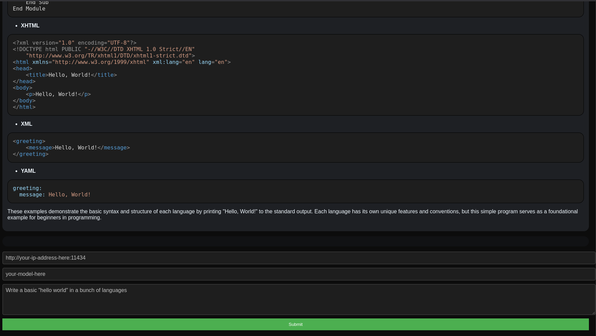

# Ollama Minimal HTML UI 🤖🥔

**_The simplest Ollama interface that actually works. Written in pure HTML/CSS for talking with Ollama._**

All code exists in a minimal amount of files so it is as auditable as possible. If you know JavaScript/HTML/CSS, you should be able to understand all code in this repository!

## Features

- **Syntax Highlighting**: Automatically highlights syntax in code for better readability.
- **Markdown Support**: All markdown is automatically sanitized and rendered as markdown.
- **Message Streams Display**: Real-time display of message streams.
- **Custom IP Address and Model Setting**: Easily set custom IP addresses and model names.
- **Message History**: Keep track of your chat history and interact beyond on message.

## Purpose

I am sick of seeing a bunch of random interfaces that depend on a whole bunch of nonsense. I know I want something simple that works that I can trust. You're here, so you probably do too.

- Minimal third-parties
- No dependency managers (`npm`/`pip`/etc...) -- All external scripts loaded are in `/external/`
- No online scripts (`cdnjs` etc...)

## Getting Started

Run this program by opening or hosting `index.html`.

That's it! No special compilation or any of that garbage 🪽

## `/external/` Notes

This repository has some dependence on third-parties for Markdown support. If you don't trust these, download your own copy from:

- `highlight.min.js`: [https://highlightjs.org/](https://highlightjs.org/)
- `theme.css`: Choose any one from [https://github.com/highlightjs/highlight.js/tree/main/src/styles](https://github.com/highlightjs/highlight.js/tree/main/src/styles)
- `markdown-it.js`: [https://github.com/markdown-it/markdown-it](https://github.com/markdown-it/markdown-it)

## Contributing

Feel free to fork this repository and contribute by opening a pull request. If you find any issues or have suggestions, please open an issue.
